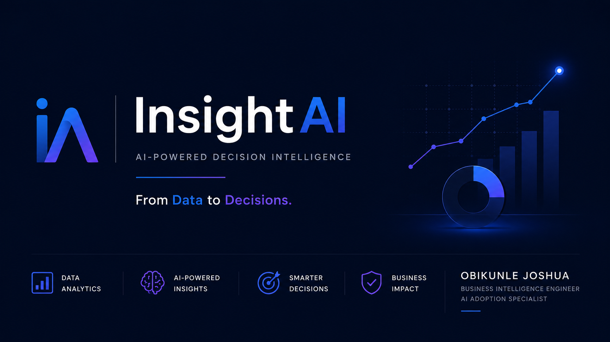
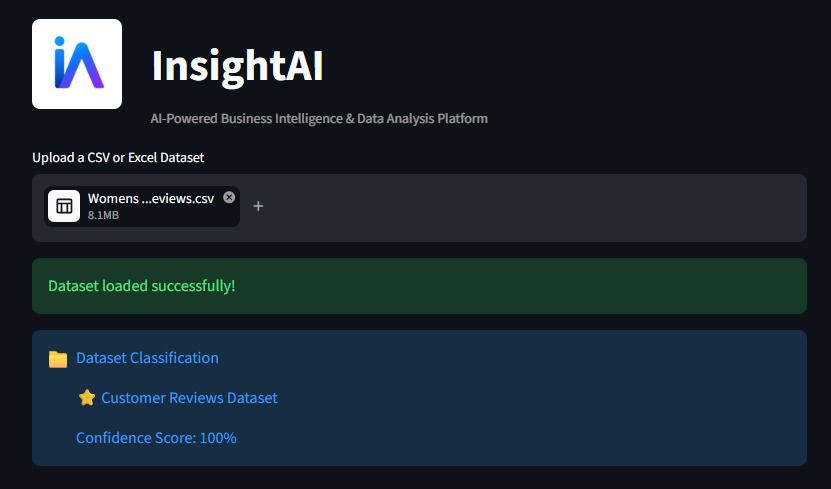
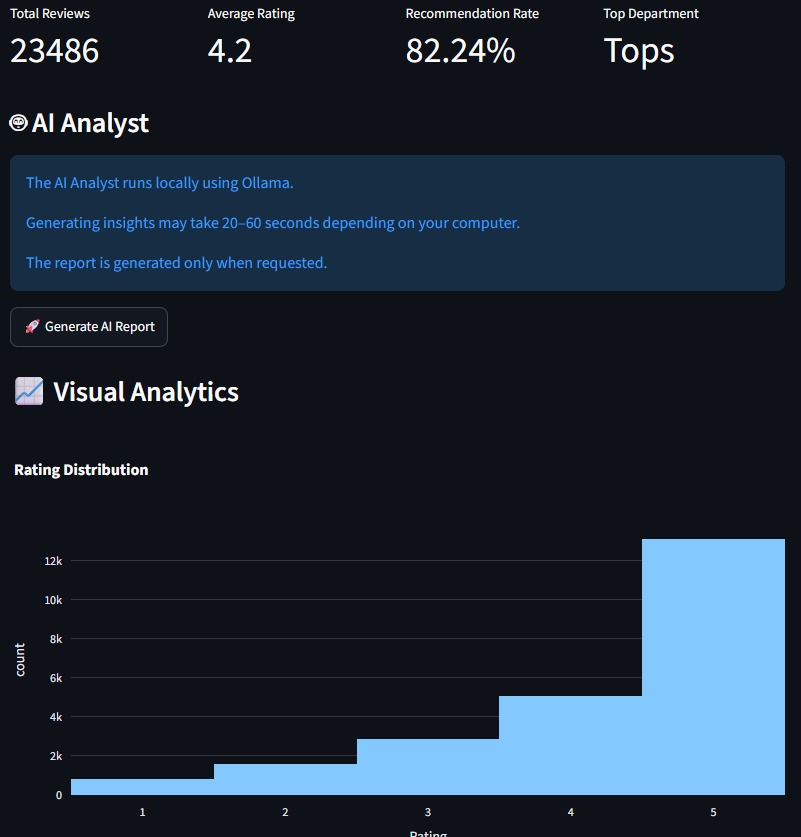

<p align="center">
  
</p>

<h2 align="center">InsightAI</h2>

<p align="center">
AI-powered Decision Intelligence Platform
</p>

<p align="center">
<i>From Data to Decisions.</i>
</p>

<p align="center">


</p>

<p align="center">

</p>

---

## Overview

InsightAI is an AI-powered Decision Intelligence Platform that helps businesses transform raw data into meaningful insights, interactive dashboards, AI-generated reports, and actionable business recommendations.

Rather than simply visualizing data, InsightAI combines Business Intelligence, Artificial Intelligence, and analytics to answer three essential questions:

- **What happened?**
- **Why did it happen?**
- **What should we do next?**

The vision is to provide organizations with a single intelligent workspace for exploring data, monitoring KPIs, generating reports, and making smarter business decisions.

---

## Key Features

### 📊 Business Intelligence

- Interactive dashboards
- KPI monitoring
- Trend analysis
- Business reporting

### 🤖 Artificial Intelligence

- AI-generated reports
- Executive summaries
- Natural language insights
- Business recommendations

### 📈 Analytics

- Exploratory Data Analysis (EDA)
- Data profiling
- Data cleaning
- Statistical summaries

### 📉 Visualization

- Interactive charts
- Dynamic filtering
- Comparative analysis
- Business metrics

---

## Dashboard

<p align="center">

</p>

---

## AI Report

<p align="center">

</p>

---

## System Architecture

```text
                 Data Sources
      CSV • Excel • SQL • APIs
                    │
                    ▼
           Data Processing Layer
      Cleaning • Validation • Profiling
                    │
                    ▼
            Analytics Engine
     KPIs • Trends • Statistics • Charts
                    │
                    ▼
             AI Intelligence
      Reports • Insights • Q&A
                    │
                    ▼
         Decision Intelligence
          Dashboards & Actions
```

---

## Tech Stack

| Category | Technologies |
|-----------|--------------|
| Language | Python |
| Framework | Streamlit |
| Data Analysis | Pandas, NumPy |
| Visualization | Plotly |
| AI | Ollama, Qwen |
| Database | SQLite *(planned)* |
| Machine Learning | Scikit-learn *(planned)* |

---

## Project Structure

```text
InsightAI/

├── assets/
│   ├── banner.png
│   ├── logo.png
│   ├── dashboard.jpeg
│   ├── ai-analyst.jpeg
│   └── icon.png
│
├── components/
│
├── services/
│
├── data/
│
├── exports/
│
├── tests/
│
├── app.py
│
├── requirements.txt
│
└── README.md
```

---

## Roadmap

### Version 1

- [x] Interactive Dashboard
- [x] KPI Monitoring
- [x] Charts & Visualizations
- [x] Modular Streamlit Architecture

### Version 2

- [ ] AI Report Generator
- [ ] Dataset Health Analysis
- [ ] Executive Summary
- [ ] Intelligent Insights

### Version 3

- [ ] Predictive Analytics
- [ ] Forecasting
- [ ] Recommendation Engine
- [ ] Chat Assistant

### Version 4

- [ ] Authentication
- [ ] Cloud Deployment
- [ ] REST API
- [ ] Multi-user Workspace

---

## Installation

Clone the repository.

```bash
git clone https://github.com/ObikunleJoshua/InsightAI.git
```

Navigate into the project.

```bash
cd InsightAI
```

Create a virtual environment.

```bash
python -m venv venv
```

Activate the environment.

**Windows**

```bash
venv\Scripts\activate
```

**Linux / macOS**

```bash
source venv/bin/activate
```

Install dependencies.

```bash
pip install -r requirements.txt
```

Run the application.

```bash
streamlit run app.py
```

---

## Current Status

🚧 InsightAI is actively under development.

Current priorities include:

- AI integration
- Performance optimization
- Faster report generation
- Improved dashboard experience
- Decision Intelligence features

---

## Author

### Obikunle Joshua

Business Intelligence Engineer • AI Adoption Specialist

Creator of **InsightAI**

📧 joshuaobikunle94@gmail.com

💼 https://www.linkedin.com/in/joshua-obikunle-1b8739111/

---

## License

This project is licensed under the **MIT License**.

---

<p align="center">


<br><br>

**InsightAI**

<br>

<i>From Data to Decisions.</i>

</p>
