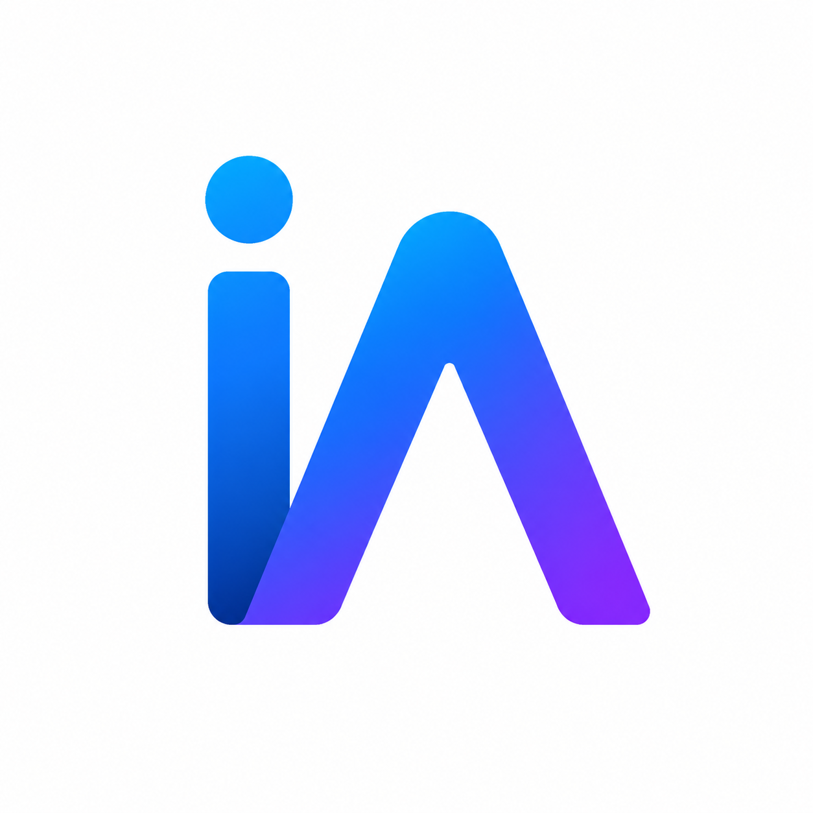
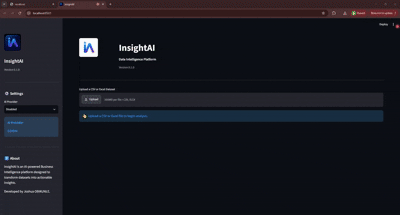

<p align="center">
  
</p>

<h1 align="center">
InsightAI
</h1>

<p align="center">
<b>AI-Powered Decision Intelligence Platform</b>
</p>

<p align="center">
From Data to Decisions.
</p>

<p align="center">


</p>

---

# Demo

▶️ **Watch the full demo here**

[Watch InsightAI in action]([https://...](https://www.linkedin.com/feed/update/urn:li:activity:7485238437487390720/))
<p align="center">
    
</p>

---

# Why InsightAI?

Business users generate more data than ever before, but extracting meaningful insights still requires technical expertise.

InsightAI bridges that gap.

Instead of only producing dashboards and statistics, InsightAI automatically understands the dataset, evaluates its quality, discovers patterns, generates business KPIs, and produces AI-powered executive reports that help users make informed decisions.

Unlike traditional analytics dashboards, InsightAI combines:

- Metadata Intelligence
- Business Intelligence
- Artificial Intelligence

into one intelligent analytics workflow.

---

# Features

## Dataset Intelligence

- Automatic metadata extraction
- Dataset classification
- Column profiling
- Data quality assessment
- Capability detection

---

## Business Intelligence

- KPI generation
- Statistical summaries
- Trend analysis
- Business metrics
- Executive reporting

---

## Artificial Intelligence

- AI-generated reports
- Executive summaries
- Business recommendations
- Natural language insights
- Multi-provider AI architecture

---

## Data Visualization

- Interactive dashboards
- Dynamic charts
- Comparative analysis
- Visual exploration

---

## Export

- Markdown
- DOCX
- PDF

---

# AI Providers

InsightAI supports multiple AI providers through a modular Provider Registry.

| Provider | Status |
|----------|--------|
| Google Gemini | ✅ |
| Ollama (Local AI) | ✅ |
| OpenAI | 🚧 |
| Azure OpenAI | 🚧 |

Switching AI providers requires **no code changes** through the application interface.

---

# Architecture

```
                  User Upload
                       │
                       ▼
                 Data Service
                       │
                       ▼
              Metadata Service
                       │
                       ▼
             Dataset Intelligence
                       │
       ┌────────┬────────┬────────┐
       ▼        ▼        ▼        ▼
 Classification Analytics Charts AI Manager
                                    │
                                    ▼
                           Provider Registry
                         ┌──────────┴──────────┐
                         ▼                     ▼
                  Google Gemini          Ollama
```

---

# Technology Stack

| Category | Technology |
|-----------|------------|
| Language | Python 3.12 |
| Framework | Streamlit |
| Data | Pandas, NumPy |
| Charts | Plotly |
| AI | Google Gemini, Ollama |
| Export | Markdown, DOCX, PDF |
| Environment | python-dotenv |

---

# Project Structure

```text
InsightAI/
│
├── assets/
├── components/
├── services/
│     ├── ai/
│     ├── analytics/
│     ├── export/
│     ├── metadata/
│     └── ...
├── tests/
├── app.py
├── requirements.txt
└── README.md
```

---

# Installation

```bash
git clone https://github.com/ObikunleJoshua/InsightAI.git

cd InsightAI

python -m venv .venv

pip install -r requirements.txt

streamlit run app.py
```

---

# Roadmap

## Version 0.1 ✅

- Metadata Engine
- Dataset Intelligence
- Business Analytics
- Interactive Dashboards
- AI Report Generation
- Google Gemini Integration
- Ollama Integration
- Multi-provider AI
- Provider Registry
- Export (Markdown, DOCX, PDF)

---

## Version 0.2

- Conversational AI ("Ask Your Data")
- SQL Database Support
- AI Model Selection
- Improved Report Formatting
- Authentication

---

## Version 0.3

- Predictive Analytics
- Forecasting
- Machine Learning
- Cloud Deployment
- REST API

---

# Contributing

Contributions, feature suggestions, and feedback are welcome.

Feel free to open an Issue or submit a Pull Request.

---

# Author

### Joshua Obikunle

**Business Intelligence Engineer | AI Adoption Specialist**

📧 joshuaobikunle94@gmail.com

💼 LinkedIn:
https://www.linkedin.com/in/joshua-obikunle-1b8739111/

---

# License

Licensed under the Apache 2.0 License.
